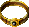
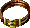
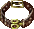
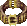

# Belts
| Item | Description |
| :-------: | :-------  |
| *BELT02*  | **Golden Girdle**  Golden Girdle:  'Golden girdle of Urnst' Created to protect a powerful wizard against malevolent warriors, this magical garment is made of red silk strewn with golden flakes.  It is enchanted to give limited protection against slashing weapons of any type.  STATISTICS:  Armor Class Bonus:  +3 vs. slashing weapons Weight:  2|
| *BELT03*  | **Girdle of Bluntness**  Girdle of Bluntness:  'Destroyer of the Hills' Having lost friends and loved ones to a series of raids by hill giants, Garrar The Powerful made it his mission to cleanse his homeland of their presence.  It is not known where he acquired this item, but with it he single-handedly dispatched dozens of the creatures, all the while protected from the blows of their clubs.  The remaining giants fled to neighboring lands, lands that lacked a similar champion and did not fare as well.  STATISTICS:  Armor Class Bonus:  +4 vs. blunt weapons Weight:  2|
| *BELT04*  | **Girdle of Piercing**  Girdle of Piercing:  'Elves' Bane' An infamous highwayman in his day, Pandar of Scardale made quite a name for himself vexing the elves of Cormanthor forest.  To their annoyance he continually used the wood to escape the law; and with the aid of this girdle, the elves' arrows as well.  Unfortunately for Pandar, pit-traps and starvation proved a slower, but effective, substitution.  STATISTICS:  Armor Class Bonus:  +3 vs. piercing weapons Weight:  2|
| *BELT05*  | **Girdle of Gender**  The cursed girdle of gender, a rare yet oft-discussed magical item, is wrought with a most powerful magic. Anyone unfortunate enough to secure it around their waist instantly finds their gender to be transformed. It is said that, not fifty years past, a nameless court jester was beheaded for presenting the girdle as a gift to Duke Lobelahn's lover.|
| *BELT06*  | **Girdle of Hill Giant Strength**  Girdle of Hill Giant Strength This plain belt makes the wearer as strong as a hill giant, but does not make him or her giant size.  Many a cocky warrior has been surprised by a much smaller opponent with remarkable strength.  More often than not a belt such as this is the reason.  STATISTICS:  Strength: set to 19|
| *BELT07*  | **Girdle of Stone Giant Strength**  Girdle of Stone Giant Strength As a young boy, Stewart Elttil was kidnapped by raiding kobolds after his family was slain.  However, en route to their den the kobolds surprised a family of stone giants.  These giants rescued Stewart and raised him as their own.  It soon became apparent that the boy, no matter how hard he tried, could not compete in the family rock-throwing contests.  The stone giant father bartered with a local wizard for this girdle, which made Stewart as strong as his brothers and sisters.  When Stewart met an untimely end, the girdle was stolen away.  STATISTICS:  Strength: set to 20|
| *BELT08*  | **Girdle of Frost Giant Strength**  Girdle of Frost Giant Strength This belt is actually the woven hair from a frost giant's beard.  When worn the belt greatly increases the wearer's strength, making him or her as strong as a frost giant.  STATISTICS:  Strength: set to 21|
| *BELT09*  | **Girdle of Fortitude**  Girdle of Fortitude This girdle greatly increases the wearer's constitution.  King Violos used it when leading an expedition against marsh trolls.  He'd been severely sickened the past winter and was no longer the healthy man he once was.  The belt gave extra years to his life and inspired his men to renew their confidence in their king once more.  STATISTICS:  Special Abilities (once per day):  Constitution: set to 18 (lasts for eight hours)|
| *BELT10*  | **Belt of Inertial Barrier**  Belt of Inertial Barrier When worn, this belt creates a dense curtain of air around the wearer.  This curtain, or barrier, provides superior protection against breath attacks as well as magic.  By the scorch marks on the worn leather, it is obvious that this belt has been worn at least once against a dragon.  STATISTICS:  Abilities:  +5 to saves vs. breath weapons  +25% Resistance to Missile Damage (Missile Attacks will do three quarters of full damage)  +50% Resistance to Magic Damage (Magic Attacks  (Such as Magic Missile, Abi-Dalzim's Horrid Wilting, etc.) will do half of full damage)|
| *BELT11*  | **Girdle of Fire Giant Strength**  This belt is actually the woven hair from a fire giant's beard.  When worn the belt greatly increases the wearer's strength.  STATISTICS:  Strength: set to 22|
