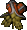

# Bracers
| Item | Description |
| :-------: | :-------  |
| *BRAC01*  | **Bracers of Defense AC 8**  Bracers are thick bands of metal or leather that are strapped, belted, or tied to a character's forearm.  Generally, the magic that is instilled in bracers is good only during combat, since most bracers help protect the wearer from injury, or improve chances to strike at an opponent.  Exceptions do exist, though such specialized items are rare at best.   STATISTICS:  Armor Class: 8 Weight: 2|
| *BRAC02*  | **Bracers of Defense AC 7**  Bracers are thick bands of metal or leather that are strapped, belted, or tied to a character's forearm.  Generally, the magic that is instilled in bracers is good only during combat, since most bracers help protect the wearer from injury, or improve chances to strike at an opponent.  Exceptions do exist, though such specialized items are rare at best.   STATISTICS:  Armor Class: 7 Weight: 2|
| *BRAC03*  | **Bracers of Defense AC 6**  Bracers of Defense AC. 6:  'Bracers to the Death' These bracers were held for decades by an undefeated gladiator, and found extensive use in arena combat.  The death of this champion marked the disappearance of this magical item, but rumors persist that they are used to this day in competitive combat across the lands.    STATISTICS:  Armor Class: 6 Weight: 2|
| *BRAC04*  | **Bracers of Archery**  Bracers of Archery:  'The Dale's Protector' During a dangerous meeting with a rival ruler, the King of the Great Dale requested the protection of his best archers in addition to his usual guard. The archers, each equipped with an enchanted bow and bracers, hid within range of the gathering. As predicted, enemy troops attempted to seize the King and force their will over his rule, but none had anticipated the amazing accuracy and lethality of the hidden archers. The King was able to escape unharmed; in fact, none of the ambush members even lived to approach him.   STATISTICS:  THAC0:  +2 (missile weapons only) Weight:  2 Not usable by:  Druid  Mage  Cleric|
| *BRAC11*  | **Bracers of Binding**  These bracers appear to be Bracers of Specialization but when donned, bind the wearers wrists together, making it quite difficult to wield a weapon or cast a spell. These bracers are sometimes offered as rewards for services rendered by the drow. The recipient, believing them to be very powerful, will often don them before examining them. At this point, the drow find it amusing to conjure a hook horror.  STATISTICS:  Special:  Casting failure 75% THAC0:  +5 penalty Damage:  -5 penalty|
| *BRAC13*  | **Bracers of Defense AC 5**  Bracers of Defense AC 5 Baron Tiri of the North commanded ten of these bracers to be made, one for each of his bodyguards.  The Baron thought it amusing when bandits - thinking them easy targets for they wore no armor -- would attack him and his men as they made excursions across the land.  The Guards of Tiri swiftly dealt with the would be attackers.  Of course Baron Tiri himself never wore a set of bracers and it was this unfortunate oversight that led to his death at the hands of an assassin's poison dagger.  STATISTICS:  Armor Class: 5 Weight: 2|
| *BRAC14*  | **Bracers of Defense AC 4
**  Bracers of Defense AC 4 Sometimes known as Gauntlets of Chain Mail, these bracers were first worn by Tapid Gornoak.  He was still an active warrior at the age of seventy-five but the weight of his armor was getting harder and harder to bear.  A companion, the sorceress Nadalarin, created these bracers for him.  She also cast a permanent illusion over him so that his men would think he still wore his heavy chain.  Tapid died twenty years later, his hands wrapped around the neck of an orc chief when old age took him.  STATISTICS:  Armor Class: 4 Weight: 2|
| *BRAC15*  | **Bracers of Defense AC 3
**  Bracers of Defense AC 3 Grinning Glen, the Knight of Fools, wore these bracers while competing in jousting tourneys.  With his skill, charm, and bravado -- no man other than he would joust without armor --  he soon became a favorite to the ladies that watched the events.   Too much of a favorite it would seem, for one afternoon he was caught frolicking with a knight's betrothed.    A challenge was issued, but in his rush Glen forget to don his bracers.  Glen died with a confused grin on his face as the knight's sword struck him, never knowing his own folly.  STATISTICS:  Armor Class: 3 Weight: 2|
| *BRAC16*  | **Bracers of Blinding Strike**  Bracers of Blinding Strike Knight Wesic of the Most Noble Order of the Radiant Heart often said 'Attack swiftly and your enemy will be so overwhelmed that the battle will be yours'.  He lived this principle through these bracers.  Before engaging in righteous battle he would unlock the magic of the Blinding Strike and quickly rush at his enemy.  More often than not his opponent would fall within the first few seconds of battle.  STATISTICS:  Abilities:  Improved Haste once per day for twenty seconds|
| *BRAC17*  | **Gloves of Pickpocketing**  Gloves of Pickpocketing A few years back Fong Moo, a famous cutpurse, known in both Baldur's Gate and Athkatla, was found dead on the road between the Gate and Beregost.  Seems he'd stolen an artifact from a powerful mage and tried escaping, with little success.  His possessions went to a nephew, who took up the same trade as his uncle, and became especially good at pickpocketing.  Whether these gloves were magical before falling into Fong's hands or if they are somehow imbued with the master's essence is not known.  STATISTICS:  Pickpocketing:  +20% Bonus|
| *BRAC18*  | **Gloves of Missile Snaring**  Gloves of Missile Snaring Foik Morur demonstrated the effectiveness of these gloves at a community fair near Beregost several years back.  He paid a local archer to fire arrows at him.  As the arrows approached, Foik's hands would move of their own accord, either knocking the arrow away or catching it.  He earned more than a few pieces of gold for his troubles, and these earnings attracted some shadowy figures to Foik's tent that evening.  The next morning Foik was found dead and the gloves missing.  STATISTICS:  AC: +2 bonus from missile attacks|
| *BRAC20*  | **Gloves of Healing**  Gloves of Healing These gloves are usually given to novices of the Most Noble Order of the Radiant Heart who have yet to acquire the ability to cast spells.  For anyone outside of the Order to wear these gloves is a rare honor.  STATISTICS:  Special Abilities: Heal up to 10 hit points of damage and any poison effects, once per day|
| *BRAC22*  | **Paladin's Bracers**  Defenders of justice are ever eager to acquire another tool which may be used to thwart the machinations of evil.  However, these particular gauntlets can only be worn by a warrior of the purest heart.  STATISTICS:   +10 to maximum HP total while equipped   Weight:  1  Useable By: Paladins|
| *BRAC23*  | **Blessed Bracers**  The willing sacrifice of a vast fortune in gold, combined with the holy venerations of the sanctifying ceremony, have convinced the blessed powers to transform these already formidable gauntlets into gloves of awesome righteous power.    STATISTICS:   Cast Cure Critical Wounds once/day   Cast Resurrection once/day  +10 to maximum HP total while equipped   Weight:  1  Useable By: Paladins|
| *BRAC24*  | **Bard's Gloves**  These leather gloves do not appear to have any special properties, though they are quite fashionable.  STATISTICS:    Weight:  1  Useable By: Bards|
| *BRAC25*  | **Wondrous Gloves**  These gem-studded leather gloves are enchanted so as to augment the skills of any bard.    STATISTICS:    +1 THAC0    +1 Bonus to AC    Bonus 2nd, 3rd and 4th level spell    Weight:  1  Useable By: Bards|
| *BRAC26*  | **Tzu-Zan's Bracers**  Although monks traditionally shun armor, these gauntlets of Grand Master Tzu-Zan are highly sought after by the practitioners of weaponless combat.  STATISTICS:    +15 to maximum Hit Point total    +1 Bonus to AC     Weight:  1  Useable By: Monks|
| *NPMISC2*  | **Jansen Techno-Gloves**  Jansen-Brand Techno-Thieving Gadgetizer Gloves - (TM)  This set of thieving tools gives Jan an additional bonus to both his lock picking and pickpocketing.  He is the only one who can use the Gloves, as no one else quite has the knack of it. Oddly, he seems to be able to actually cast spells while wearing the things.  Must be because they got style.  STATISTICS:  Lockpicking: +20% Pick Pockets: +20%|

# Gauntlets
| Item | Description |
| :-------: | :-------  |
| *BRAC06*  | **Gauntlets of Ogre Power**  Gauntlets of Ogre Power:  'Hands of Takkok' The Hands of Takkok are exactly that; his very hands.  He lost them when he attacked a strange man crossing the Spine of the World.   The mysterious man turned out to be a mage of incredible power, and he used Takkok's hands to create this pair of ogre skin gauntlets.  STATISTICS:  Strength:  set to 18/00 Weight:  2 Not usable by:   Thief  Mage|
| *BRAC07*  | **Gauntlets of Dexterity**  Gauntlets of Dexterity:  'The Brawling Hands' This pair of gauntlets was likely developed in Kara-Tur to aid masters of the martial arts.  Legends speak of such masters from the Far East bringing these items with them on their journeys, though details remain sketchy.   STATISTICS:  Dexterity:  set to 18 Weight: 2 Not usable by:|
| *BRAC08*  | **Gauntlets of Fumbling**  Cursed Gauntlets of Fumbling:  'Elander's Gloves of Misplacement' With mischief in mind, the impetuous Elander set out to craft these cursed gauntlets to best a rival.  It turns out his malice got the best of him, when he mistook these gloves for another pair.   STATISTICS:  *CURSED* THAC0:  -10 penalty Dexterity:  -2 penalty Weight:  2 Special:  Can only be removed by a 'remove curse' spell|
| *BRAC09*  | **Gauntlets of Weapon Skill**  Gauntlets of Weapon Skill:  'Xarrnous' Second Sword Arm' Perhaps the most well-known owner of these gauntlets was a mercenary, named Xarrnous.  He specialized in smuggling, and frequently loaned these gauntlets to clients if they were to travel with him.  In his eyes, an extra sword arm was always handy.  STATISTICS:    THAC0:  +1 bonus Weight:  2 Not usable by:|
| *BRAC10*  | **Gauntlets of Weapon Expertise**  Gauntlets of Weapon Expertise:  'Legacy of the Masters' Highly sought after among novice warriors, these items were once the property of the royal family of Threskel.  Imparting a portion of the prince's legendary skill, these gauntlets grant the bearer mastery over all forms of melee weapons.  The majority of their many previous owners seem to have come to bloody ends though; the gloves grant the ability of experience, but not the wisdom.  STATISTICS:  THAC0:  +1 bonus Damage:  +2 bonus Weight:  1|
| *BRAC19*  | **Gauntlets of Crushing**  Gauntlets of Crushing A foreigner from the east who went by the name of Floating Bear became well known through the Sword Coast.  Unarmed and unarmored he bested many powerful warriors.  One night, in the arms of a lady of the night, he whispered his secret.  His martial arts training was supplemented by the thin gauntlets he wore, which allowed him to hit more accurately and with harder punches than bare fists would normally allow.  The woman stole the gloves and took the next boat out.  Floating Bear soon left, returning to his homeland.  STATISTICS:  THAC0: +4 bonus when attacking with fists Damage: +4 bonus when attacking with fists|
| *BRAC21*  | **Gauntlets of Extraordinary Specialization**  These rarest of gauntlets are highly sought after by duelists, warriors, and fighters of all kinds.  STATISTICS:   Adds one extra 1/2 attack/round   THAC0:  +1 bonus   Damage:  +2 bonus   Weight:  1  Useable By:  Fighters  Paladins  Rangers|
