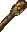
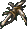
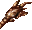
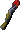
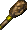

# Clubs
| Item | Description |
| :-------: | :-------  |
| *BLUN01*  | **Club**  Most clubs are stout, hardwood sticks, narrow at the grip and wider at the end.  This simple weapon has been used since mankind first began using tools.  Anyone can find a good stout piece of wood and swing it; hence the club's widespread use.  STATISTICS:  Damage:  1D6 Damage type:  crushing Weight: 3 Speed Factor: 4 Proficiency Type:Club Type:  1-handed Requires: 5 Strength Not Usable By:  Mage|
| *BLUN10*  | **The Root of the Problem**  The Root of the Problem Club +1, +3 vs. unnatural creatures This enchanted club is said to have existed since the time of the fall of Netheril and the birth of the great Anauroch Desert. While the toll on civilization was great, the true victims were nature's creatures, condemned to stand and watch as their homes decayed and died. As habitats receded, those that remained were invaded by displaced hordes of creatures, the more impatient of which marched on unspoiled land taking whatever they wished. This particular weapon is said to have come from a dryad's tree, a final gift to nature's cause from a woodland spirit that could not hold back the invaders of her land. Hers was a bittersweet pain, as her wood might not have suffered so if it had not been so strong and lush. Less respecting scholars have since bestowed the item's ironic name, though the humor is not appreciated among nature's more devout followers.  STATISTICS:  THAC0:  +1, +3 vs. unnatural creatures Damage:  1D6 +1, +3 vs. unnatural creatures, +1 acid damage Damage type:  crushing and acid Weight: 3 Speed Factor: 3 Proficiency Type: Club Type:  1-handed Requires: 5 Strength Not Usable By:  Mage|
| *BLUN22*  | **Club +3, Blackblood**  Club +3: Blackblood This oak club is coated with darkened dried globs of a tar-like substance.  During battle this substance glows black with an inner light, and becomes thick and fluid.  When the club strikes an opponent it delivers additional acid damage from the liquid splashing over the victim.  STATISTICS:  THAC0: +3 bonus Damage:  1D6 + 3, +3 acid damage Damage type:  crushing Weight: 3 Speed Factor: 4 Proficiency Type: Club Type:  1-handed Requires: 5 Strength Not Usable By: Mage|
| *BLUN23*  | **Bone Club +2, +3 vs. Undead**  Bone Club +2, +3 vs. Undead This vicious club was created hundreds of years ago, reportedly by a shaman on a quest for revenge.  His family had fallen to undead, and so personal was his rage that he amputated his own leg, using the femur for the body of the weapon.  Magical runes empower it, though it is likely the sheer force of his hatred would have served on its own.    STATISTICS:  THAC0: +2, +3 vs. Undead Damage:  1D6 + 2, +3 vs. Undead Damage type:  crushing Weight: 3 Speed Factor: 4 Proficiency Type: Club Type:  1-handed Requires: 5 Strength Not Usable By: Mage|
| *BLUN24*  | **Club +2, Gnasher**  Club +2: Gnasher Makal of the Pine, a devious druid, carved this club and bonded it with the spirit of his wolverine companion.  Like that tenacious creature, Gnasher is a dangerous weapon in the hands of a skilled user.  When the club strikes, sharp splinters dig into the victim's flesh, causing extreme pain and even extra damage that continues for some time after the blow.  Makal used the club successfully on several occasions, earning the anger of orc loggers threatening his forests.   STATISTICS:  THAC0: +2 bonus Damage:  1D6 + 2, slivers add 2 points extra damage each round for four rounds Damage type:  crushing Weight: 3 Speed Factor: 4 Proficiency Type: Club Type:  1-handed Requires: 5 Strength Not Usable By: Mage|
| *BLUN26*  | **Club of Detonation +3**  This crude wooden club burns with the raging spirit of the demon forever trapped within by the powerful enchantments placed on the weapon.  Occasionally, however, the demon's wrath escapes in a fiery blast.  STATISTICS:  Combat Abilities:    20% chance target will take an additional 10 points of fire damage with each successful attack    7% chance a fireball will automatically detonate with each successful attack  THAC0: +3 bonus Damage:  1D6 + 3, +3 fire damage Damage type:  crushing Weight: 3 Speed Factor: 4 Proficiency Type: Club Type:  1-handed Requires: 5 Strength Not Usable By: Mage|
| *BLUN27*  | **Club of Detonation +5**  The enchantments from the Ring of Fire resistance makes the demon spirit trapped within this weapon easier to control - though the wrath of the creature may occasionally still be released without warning.  STATISTICS:  Combat Abilities:    30% chance target will take an additional 15 points of fire damage with each successful attack    5% chance a fireball will automatically detonate with each successful attack  THAC0: +5 bonus Damage:  1D6 + 5, +5 fire damage Damage type:  crushing Weight: 1 Speed Factor: 4 Proficiency Type: Club Type:  1-handed Requires: 5 Strength Not Usable By: Mage|
| *BLUN31*  | **Club +3**  Most clubs are stout, hardwood sticks, narrow at the grip and wider at the end.  This simple weapon has been used since mankind first began using tools.  Anyone can find a good stout piece of wood and swing it; hence the club's widespread use.   This particular club has been magically enhanced.  STATISTICS:  THAC0: +3 bonus Damage:  1D6 +3 Damage type:  crushing Weight: 1 Speed Factor: 1 Proficiency Type:Club Type:  1-handed Requires: 5 Strength Not Usable By:  Mage|
