# Long Swords
| Item | Description |
| :-------: | :-------  |
| *DWSW1H02*  | **Drow Longsword +3**  Drow Longsword +3 These swords are usually referred to as doubled-edged swords, war swords, or military swords.  In many cases, the long sword has a single-edged blade. Most long swords have a double-edged blade and a sharp point at the tip.  Despite the tip, the long sword is designed for slashing, not thrusting.  This item, like most drow equipment, is created using Adamantine, an alloy of adamantite that quickly turns to dust if removed from the Underdark. STATISTICS:  THAC0: +3 bonus Damage:  1D8 +3 Damage type:  slashing Weight: 4 Speed Factor: 2 Proficiency Type: Long Sword Type:  1-handed Requires: 6 Strength Not Usable By:  Druid  Cleric  Mage |
| *MISCBC* 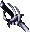 | **Blackrazor**  Blackrazor, Long Sword +3 This sword radiates evil like a sour odor, and the owner never knows if he wields the weapon, or if it wields him.  In addition to its combat abilities, Blackrazor slowly regenerates its owner with the drained strength of opponents.  STATISTICS:  Equipped Ability :   Regeneration: 1 hp every 5 seconds   Immunity to Charm and Fear   With every hit it has a 15% chance of draining 4 levels, healing the wielder by 20 hit points, and hasting him for 20 seconds as well as increasing his strength by 3 points for 20 seconds.  THAC0: +3 bonus Damage:  1D8 +3 Damage type:  slashing Weight: 4 Speed Factor: 2 Proficiency Type: Long Sword Type:  1-handed Requires: 6 Strength Not Usable By:  Druid  Cleric  Mage|
| *SW1H04* 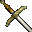 | **Long Sword**  These swords are usually referred to as doubled-edged swords, war swords, or military swords.  In many cases, the long sword has a single-edged blade. There is no single version of the long sword; the design and length vary from culture to culture, and may vary within the same culture depending on the era.  Among the most common characteristics of all long swords is their length, which ranges from 35 inches to 47 inches.  In the latter case, the blade is known to take up 40 inches of the total length.  Most long swords have a double-edged blade and a sharp point at the tip.  Despite the tip, the long sword is designed for slashing, not thrusting.   STATISTICS:  Damage:  1D8 Damage type:  slashing Weight: 4 Speed Factor: 5 Proficiency Type: Long Sword Type:  1-handed Requires: 6 Strength Not Usable By:  Druid  Cleric  Mage |
| *SW1H05* 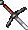 | **Long Sword +1**  These swords are usually referred to as doubled-edged swords, war swords, or military swords.  The blade hums slightly in your hand, the only overt evidence that magic runs through it.  STATISTICS:  THAC0:  +1 bonus Damage:  1D8 +1 Damage type:  slashing Weight: 4 Speed Factor: 4 Proficiency Type: Long Sword Type:  1-handed Requires: 6 Strength Not Usable By:  Druid  Cleric  Mage|
| *SW1H06*  | **Long Sword +2**  Long Sword +2:  'Varscona' Blades of this type were long used by Sharran priests during the sacrificial rites of "Feast of the Moon" ceremonies.  Legends say that, when she passed on, the remains of this sword's wielder were mummified and the blade was placed within her chest as a symbol of power.  In the first stage of a long forgotten ritual, she was to have been exhumed in a season, born again in some new form.  Unfortunately, cult wars killed the few that knew of her existence; her tomb became a prison where she was forgotten, and there she developed a rage that bordered on insanity.  Her grave was eventually found, but it was deserted and gave no indication of her whereabouts.  Some venture to say that her anger was so concentrated, she became one with the very blade of her weapon.  Regardless, after hundreds of years surrounded by constant hate, the sword harvested a power of its own.  It is now exceedingly deadly in combat.    STATISTICS:  Damage:  1D8 +2 Special:  +1 Cold damage THAC0:  +2 bonus Damage type:  slashing Weight: 3 Speed Factor: 3 Proficiency Type: Long Sword Type:  1-handed Requires: 6 Strength Not Usable By:  Druid  Cleric  Mage|
| *SW1H13*  | **Moonblade**  This potent weapon was created by the smiths of ancient Myth Drannor.  Moonblades are used in the long process of selecting a ruler for the isle of Evermeet.  A Moonblade chooses its owner, and in the case of this sword it has chosen the elf, Xan.  Only Xan can use this blade, anyone else who tries will find themselves unable to lift the sword.  This particular Moonblade gives resistance to fire and gives its user a bonus to his armor class.  STATISTICS:  Damage:  1D8 Damage type:  slashing Bonus to hit:  3 Bonus to damage:  3 Special:  +1 bonus to Armor Class  +50% Fire Resistance Weight: 4 Speed Factor: 5 Proficiency Type:  Small Sword Type:  1-handed Not Usable By:  Everyone but Xan |
| *SW1H19*  | **The Vampire's Revenge**  It would seem that the very speculation of this weapon's existence has conspired to pull it from the realm of fantasy and into the everyday, though, as with all things that come from dreams, it is not as it truly seems. The blade is indeed vampiric, as the name would suggest; though not in the manner the finder might have hoped. It is rumored that the blade, instead of performing as one might think a vampiric blade would, was actually constructed by vampires as a trap for those that could eventually oppose them. These incredibly clever fiends have apparently fashioned numerous versions of these unfortunate blades over time, and they are the bane of all right-thinking adventurers. Each swing actually inflicts damage upon the wielder, as his life energies are drained in order to heal his intended victim. Were this not enough, the weapon is cursed so as to prevent it's removal, and the user is smitten with a wasting of the mind, that he might not even think of trying to rid himself of it. This may be among the few magical treasures that are simply not worth the trouble of seeking, and one might better spend ones time having a lovely beverage, rather than gallivanting about the wilderness with a pack full of rubbish chasing phantoms.  STATISTICS:  Damage:  1D8 +1 THACO:  +1 bonus Special: Inflicts damage upon the wielder and heals the target.  Special: Affects intelligence in a negative manner...I think...duhhhhhh Damage type:  slashing Weight: 4 Speed Factor: 4 Proficiency Type: Long Sword Type:  1-handed Requires: 6 Strength Not Usable By:  The Lucky Ones  Druid  Cleric  Mage|
| *SW1H24* 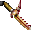 | **Flame Tongue**  Flame Tongue +1  There was a time before Neverwinter was warm and before the great Anauroch was dry...or so it is said.  Few relics remain to prove such an age existed, and fewer still have an identifiable purpose.  "The Burning Earth" seems straightforward enough -it burns a victim with magical fire, and a cryptic rune seems to suggest that the power comes from the ground itself- but whomever constructed it remains a mystery.  It looks a perfectly serviceable weapon, but something in the balance or grip is...wrong.  It strains the forearm a touch, and does not fit the hand just right.  It doesn't seem to hurt a warrior's performance, aside from the nagging doubt that the blade was not made for him...or any other humanoid.  STATISTICS:  THAC0:  +1 bonus, +2 vs. regenerating creatures, +3 vs. cold-using creatures, +4 vs. undead Damage:  1D8 +1, +2 vs. regenerating creatures, +3 vs. cold-using creatures, +4 vs. undead Damage type:  slashing Weight: 4 Speed Factor: 3 Proficiency Type: Long Sword Type:  1-handed Requires: 6 Strength Not Usable By:  Druid  Cleric  Mage|
| *SW1H31* 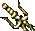 | **Daystar**  Sunblade: Daystar Whether created specifically for use in the service of Torm or appropriated at some point in the long history of the church, Paladins of the Loyal Fury have made good use of Daystar in their battles against evil undead.  Through magic or blessing it is empowered with the Sunray, a force of pure life energy so potent that it slays both living and unliving.  STATISTICS: Special Abilities (once per day): Sunray  Damage: 3D6 (save vs. spells or be blinded for 10 rounds)  Undead: an additional 1d6 points of damage per level of caster (save vs. spells or be destroyed)  Range: 20 ft  Area: 20 ft radius  THAC0:  +2 bonus, +4 vs. evil creatures Damage:  1D8 +2, +4 vs. evil creatures, does double damage against undead Damage type:  slashing Weight: 2 Speed Factor: 3 Proficiency Type: Long sword Type:  1-handed Requires: 6 Strength Not Usable By:  Druid  Cleric  Mage|
| *SW1H32* 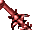 | **Dragonslayer**  Long sword +2:  Dragonslayer (Peridan) Few dare to create items such as this, for who does not fear the wrath of dragons, and what action would more tempt their reckoning?  Yet, at a time lost in Faerun's past, there was a need, and this sword was forged in answer.  Tempered by a wizard's skill, this blade protects the wielder from the fear they should rightly feel while staring down a dragon's maw.  It also bolsters with regeneration, dispels the trickery of illusions, and dares to do double damage against the greatest creatures of the Realms.  STATISTICS:  Equipped Abilities:   Immunity to Fear  Regenerate 1 hit point every 10 rounds  Special Abilities (once per day):  Detect Invisible  THAC0:  +2 bonus Damage:  1D8 +2, double damage against dragons Damage type:  slashing Weight: 3 Speed Factor: 3 Proficiency Type: Long sword Type:  1-handed Requires: 6 Strength Not Usable By:  Druid  Cleric  Mage|
| *SW1H33*  | **Ras +2**  Long Sword +2: Ras, The Dancing Blade Beroalf was a barbarian who traveled from the cold north in search of adventure.  He sought treasures and glory, but soon all he wanted were companions to share in the excitement of battle, much like those he had left behind in his faraway village.  Unfortunately, his coarse remarks and rudimentary hygiene repelled most travelers he met, until he expressed his thoughts to a sympathetic mage.  The mage, for a price, constructed Ras, the dancing blade.  Though not quite what Beroalf had in mind, he was thrilled nonetheless, and wielded the sword for many years.  How they were ultimately separated is not known.  STATISTICS:  Special Abilities: Dancing sword can attack on its own for 4 rounds. THAC0:  +2 bonus Damage:  1D8 +2 Damage type:  slashing Weight: 3 Speed Factor: 3 Proficiency Type: Long sword Type:  1-handed Requires: 6 Strength Not Usable By:  Druid  Cleric  Mage|
| *SW1H35* 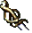 | **Adjatha The Drinker +2**  Adjatha the Drinker, Long Sword +2 This blade belonged to Dabbar, a long dead servant of Bhaal that exercised control over his minions in the most brutal of ways.  In addition to strengthening the mind against the guile of others, the sword absorbs life energy from an opponent with each successful hit, healing the user.  Dabbar considered it a failure of his officers if he returned from battle in less than perfect health, and as the rest of the company watched, he would administer beatings until fully healed.     STATISTICS:  Equipped Abilities: Wielder immune to charm and domination spells Special Abilities: Each hit heals the wielder of 1 hit-point damage THAC0:  +2 bonus Damage:  1D8 +2 Damage type:  slashing Weight: 3 Speed Factor: 3 Proficiency Type: Long sword Type:  1-handed Requires: 6 Strength Not Usable By:  Druid  Cleric  Mage|
| *SW1H36*  | **Namarra +2**  Namarra, Long Sword +2 Also known as Neversleep, this ancient blade is thought to have been present at some of the most influential conflicts in Faerun's history.  Sightings have been noted as far north as Thay and as south as the jungles of Chult, though documentation is oddly lacking regarding the details.  It is perhaps a result of the sword's ability to silence all sound within a large radius, removing the effectiveness of attacking mages but also preventing any discussion that might have followed.  STATISTICS:  Special Abilities: Casts Silence 15' radius three times a day THAC0:  +2 bonus Damage:  1D8 +4 Damage type:  slashing Weight: 3 Speed Factor: 3 Proficiency Type: Long sword Type:  1-handed Requires: 6 Strength Not Usable By:  Druid  Cleric  Mage|
| *SW1H40* 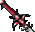 | **Blade of Roses +3**  Blade of Roses, Long Sword +3 This blade possesses an unearthly splendor, and it is likely that Sune, the goddess of beauty and passion, had a hand in its creation.  The effect it has on the wielder is immediate, and more than once in its history has this sword been the secret behind a lackluster soldier's sudden elevation at court.  STATISTICS:  Equipped Abilities:   Charisma: +2 bonus THAC0:  +3 bonus Damage:  1D8 + 3 Damage type:  slashing Weight: 3 Speed Factor: 2 Proficiency Type: Long sword Type:  1-handed Requires: 6 Strength Not Usable By:  Druid  Cleric  Mage|
| *SW1H41* 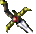 | **Long Sword +2**  Long Sword +2 A sword of standardized enchantment, powerful though it is.  The great southern nations are said to have once had legions of their soldiers armed in such a fashion, a force that must have appeared truly imposing on the battlefield. The days of such extravagance are long past though.  STATISTICS:  THAC0:  +2 bonus Damage:  1D8 + 2 Damage type:  slashing Weight: 3 Speed Factor: 3 Proficiency Type: Long sword Type:  1-handed Requires: 6 Strength Not Usable By:  Druid  Cleric  Mage|
| *SW1H54*  | **The Equalizer**  Long Sword: The Equalizer Such is the age of this sword that its true origin has been lost to time, but markings hint that it was possibly forged in the service of Helm.  Also called the "Sword of Neutrality", it seems designed to seek and terminate extremes, to shift the universe closer to harmonious equilibrium.  The further the behavior of a target from true balance, the more potent the damage they suffer.  STATISTICS:  Always considered +3 when determining what it can hit. THAC0 & Damage:   vs True Neutral: +0 to hit, +0 damage   vs Chaotic Neutral, Lawful Neutral  +1 to hit, +2 damage   vs Neutral Good, Neutral Evil: +2 to hit, +4 damage   vs other alignments: +3 to hit, +6 damage Damage type:  slashing Equipped Abilities:       Immune to Charm and Confusion Weight: 3 Speed Factor: 3 Proficiency Type: Long sword Type:  1-handed Requires: 6 Strength Not Usable By:  Druid  Cleric  Mage|
| *SW1H60* 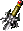 | **Angurvadal +4**  Also known as the Stream of Anguish, this is the legendary burning blade of Frithiof.       STATISTICS: Special Abilities: Once per day increase user's strength to 22 for 60 seconds.  THAC0: +4 bonus Damage:  1D8 +4, +1 fire damage Damage type:  slashing Weight: 2 Speed Factor: 1 Proficiency Type: Long Sword Type:  1-handed Requires: 6 Strength Not Usable By:  Druid  Cleric  Mage|
| *SW1H61*  | **Angurvadal +5**  The true power of Frithiof's blazing sword has been unleashed by the Liquid Mercury.  STATISTICS: Special Abilities: Increase strength to 22 when equipped. User is immune to level drain when equipped.  THAC0: +5 bonus Damage:  1D8 +5, 1d4+1 fire damage Damage type:  slashing Weight: 2 Speed Factor: 0 Proficiency Type: Long Sword Type:  1-handed Requires: 6 Strength Not Usable By:  Druid  Cleric  Mage|
| *SW1H73*  | **Long Sword +3**  These swords are usually referred to as doubled-edged swords, war swords, or military swords.  The blade hums slightly in your hand, the only overt evidence that magic runs through it.  STATISTICS:  THAC0:  +3 bonus Damage:  1D8 +3 Damage type:  slashing Weight: 2 Speed Factor: 2 Proficiency Type: Long Sword Type:  1-handed Requires: 6 Strength Not Usable By:  Druid  Cleric  Mage|
| *SW1H77* 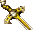 | **The Answerer +4**  The last swing of a battle is more important than the first.  Such is the philosophy embodied in this powerful weapon.  Although the strange design of The Answerer makes it difficult to take the initiative in combat, with each hit it makes an opponent more vulnerable to subsequent attacks.  STATISTICS:  Each hit lowers opponents' Magic Resistance by 15% Each hit applies a penalty of -2 to opponents' AC   THAC0:  +4 bonus Damage:  1D8 +4 Damage type:  slashing Weight: 2 Speed Factor: 9 Proficiency Type: Long Sword Type:  1-handed Requires: 6 Strength Not Usable By:  Druid  Cleric  Mage|
| *WA2S1H*  | **Sword of Balduran**  Sword of Balduran The Sword of Balduran was the favored weapon of the famous adventurer who founded the city of Baldur's Gate.   It is part of a set of weapons and armor that was stolen from the museum in the city of Baldur's Gate.  STATISTICS:  Equipped Abilities: +10% to lore +10% Magic Resistance Damage:  1D8 +2 THAC0:  +2 bonus Damage type:  slashing Weight: 3 Speed Factor: 3 Proficiency Type: Long Sword Type:  1-handed Requires: 5 Strength Not Usable By:  Druid  Cleric  Mage|
