# Short Swords
| Item | Description |
| :-------: | :-------  |
| *NPSW01* 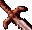 | **Sword of Arvoreen**  Sword of Arvoreen  Another gift to Mazzy from Arvoreen, this short sword may only be used by halflings.  The enchantments that exist within this sword give it the ability to slow any opponent struck by it.  STATISTICS:  Abilities: Target must save vs. wand or have movement rated slowed by 2 (for 45 seconds).  Wielder of the sword is immune to slow and stun effects. THAC0: +2 bonus Damage:  1D6 +2 Damage type:  piercing Weight: 3 Speed Factor: 1 Proficiency Type: Short Sword Type:  1-handed Usable By:  Halflings|
| *NPSW05* 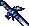 | **Entropy**  Entropy This +2 abyssal greensteel blade is one of Haer'Dalis' favorite weapons.  This shortsword is capable of inflicting an additional three points of poison damage if the target fails a saving throw.  This blade may only be used by tieflings.  STATISTICS:  Special Abilities: 3 points of poison damage if target fails save THAC0:  +2 bonus Damage:  1D6 +2 Damage type:  piercing Weight: 2 Speed Factor: 1 Proficiency Type: Short Sword Type:  1-handed Usable By:  Tieflings|
| *NPSW06* 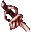 | **Chaos Blade**  Chaos Blade Chaos is a +2 short sword usable only by tieflings.  Every time it strikes an opponent, he or she loses 2 points of dexterity (for 30 seconds).  Haer'Dalis prefers using Chaos with its partner -- Entropy.  When dual wielding these two blades, Haer'Dalis is a dangerous opponent.  STATISTICS:  Special Abilities: Target loses 2 points of dexterity each hit (duration: 30 seconds) THAC0:  +2 bonus Damage:  1D6 +2 Damage type:  piercing Weight: 2 Speed Factor: 1 Proficiency Type: Short Sword Type:  1-handed Usable By:  Tieflings|
| *SW1H07* 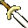 | **Short Sword**  The short sword is the first type of sword to come into existence.  In the simplest of terms, a short sword can be considered a dagger with a blade so long that it can no longer be called a dagger.  The term short sword does not exist in sword classifications.  However, it has come to be used to describe a double-edged blade about two feet in length.  The sword tip is usually pointed, ideal for thrusting.    STATISTICS:  Damage:  1D6 Damage type:  piercing Weight: 3 Speed Factor: 3 Proficiency Type: Short Sword Type:  1-handed Requires: 5 Strength Not Usable By:  Druid  Cleric   Mage |
| *SW1H08* 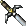 | **Short Sword +1**  The short sword is the first type of sword to come into existence.  In the simplest of terms, a short sword can be considered a dagger with a blade so long that it can no longer be called a dagger.  This short blade is magical, improving accuracy and damage.  STATISTICS:  THAC0:  +1 bonus Damage:  1D6 +1 Damage type:  piercing Speed Factor: 2 Weight:  3 Proficiency Type: Short Sword Type:  1-handed Requires: 5 Strength Not Usable By:  Druid  Cleric   Mage|
| *SW1H09* 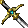 | **Short Sword +2**  This short sword has been forged by hands both magical and highly skilled.  Neither nick nor stain mar the flawless blade.  When used in battle the blade radiates magic and gifts the wielder with increased skill.  STATISTICS:  THAC0:  +2 bonus Damage:  1D6 +2 Damage type:  piercing Speed Factor: 1 Weight:  2 Proficiency Type: Short Sword Type:  1-handed Requires: 5 Strength Not Usable By:  Druid  Cleric   Mage |
| *SW1H10*  | **Short Sword of Backstabbing**  Short Sword of Backstabbing:  'The Shadow's Blade' The Shadow's Blade was created to be the perfect assassin's tool.  It is highly sought after by any who settle differences with a blade, and many that possess it do not do so for long.  STATISTICS:  THAC0:  +3 bonus Damage:  1D6 +3 Damage type: piercing Weight: 3  Speed Factor: 0 Proficiency Type: Short Sword Type:  1-handed Requires: 5 Strength Not Usable By:  Druid  Cleric   Mage|
| *SW1H25* 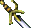 | **Kundane +2**  Kundane +2: Sword of Quickness  Disfigured as a child, Dramnek Olk was ostracized and ridiculed by his peers.  In his loneliness he spent many hours alone in the hills overlooking Trademeet.  A nearby wizard, Galloma, discovered the youth and found in him a kindred soul.  The two fast became friends; master and apprentice.  Galloma died before Dramnek's tutorage could be completed, however, and the youth found himself once more alone in the world.  Eventually he made his way to the streets of Athkatla.  There he became a cutpurse, augmenting his thieving skills with the little magic he'd learned from Galloma.  Eventually he crafted this sword, which enhanced Dramnek's weak physical body.  This weapon has no speed factor.  STATISTICS:  THAC0:  +2 bonus Damage:  1D6 +2 Damage type:  piercing Weight: 2 Speed Factor: 0 Proficiency Type: Short Sword Type:  1-handed Requires: 5 Strength Not Usable By:  Druid  Cleric   Mage|
| *SW1H26*  | **Ilbratha +1**  Ilbratha, Short Sword +1  This ancient bronze sword is set with six matching bloodstones, and was apparently forged for Azoun the First, a long dead king of Cormyr.  It saw little use, and eventually found its way to a favored of the king's guards.  Despite the aid of its illusionary magic, that unnamed soldier fell in a later battle, and the sword was lost to brigands or scavengers.  STATISTICS:  Special Abilities: Casts Mirror Image once per day THAC0:  +1 bonus Damage:  1D6 +1 Damage type:  piercing Weight: 2 Speed Factor: 2 Proficiency Type: Short Sword Type:  1-handed Requires: 5 Strength Not Usable By:  Druid  Cleric   Mage|
| *SW1H27* 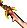 | **Arbane's Sword +2**  Arbane's Sword of Agility One of many created in the name of the mage who first discovered how to enchant a blade in this manner, this was the weapon of the outlaw Garno, and many a cleric died at its edge.  Garno became disillusioned with the gods when his family was put to the torch by clerics of Loviatar, and spent his life seeking revenge.  Despite his focussed hatred of the devout, it is thought that one of the gods of chaos had a hand in Garno's acquisition of this sword, delighting in the havoc that followed the young man.   STATISTICS:  Equipped Abilities: Wearer is immune to hold person Special Abilities: Once per day can haste the character for 12 seconds THAC0:  +2 bonus Damage:  1D6 +2 Damage type:  piercing Weight: 2 Speed Factor: 1 Proficiency Type: Short Sword Type:  1-handed Requires: 5 Strength Not Usable By:  Druid  Cleric   Mage|
| *SW1H28* 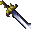 | **Cutthroat +4**  Cutthroat +4  This weapon has a bloody history, having been used to exercise its namesake many times.  Popular among the assassin trade for its size and enchantment, it has been in the possession of many of the Realms' more dangerous citizens, though seldom remaining in one place any length of time.  STATISTICS:  THAC0:  +4 bonus Damage:  1D6 +4 Damage type:  piercing Weight: 2 Speed Factor: 1 Proficiency Type: Short Sword Type:  1-handed Requires: 5 Strength Not Usable By:  Druid  Cleric   Mage|
| *SW1H29* 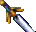 | **Short Sword +2**  Short Sword +2 The term "short sword" does not exist in sword classifications, but has come to describe the earliest type of sword, a double-edged blade about two feet in length.  There are etched runes on the surface of this weapon that glow during combat, indicating it has undergone some form of enchantment, but no identifying marks can be recognized.  STATISTICS:  Damage:  1D6 +2 THAC0:  +2 bonus Damage type:  piercing Weight: 2 Speed Factor: 1 Proficiency Type: Short Sword Type:  1-handed Requires: 5 Strength Not Usable By:  Druid  Cleric   Mage|
| *SW1H58*  | **Short Sword of Mask +4**  This blade is highly prized by those who serve the Shadowlord, as well as any who engage in shadowy business.   STATISTICS: Combat Abilities: 15% chance with every hit that opponent is entangled for 24 seconds, no save  THAC0:  +4 bonus Damage:  1D6 +4 Damage type:  Piercing Weight: 2 Speed Factor: 0 Proficiency Type: Short Sword Type:  1-handed Requires: 5 Strength Not Usable By:  Druid  Cleric   Mage|
| *SW1H59*  | **Short Sword of Mask +5**  Combined with the Heart of the Damned into a single lethal weapon, this deadly blade is the preferred tool of assassins and thieves.   STATISTICS: Combat Abilities:  15% chance to drain 1 level from opponent with every hit 15% chance with every hit that opponent is entangled for 24 seconds, no save  THAC0:  +5 bonus Damage:  1D6 +5 Damage type:  Piercing Weight: 2  Speed Factor: 0 Proficiency Type: Short Sword Type:  1-handed Requires: 5 Strength Not Usable By:  Druid  Cleric   Mage|
| *SW1H74* 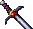 | **Short Sword +3**  This short sword has been forged by hands both magical and highly skilled.  Neither nick nor stain mar the flawless blade.  When used in battle the blade radiates magic and gifts the wielder with increased skill.  STATISTICS:  THAC0:  +3 bonus Damage:  1D6 +3 Damage type:  piercing Speed Factor: 0 Weight:  1 Proficiency Type: Short Sword Type:  1-handed Requires: 5 Strength Not Usable By:  Druid  Cleric   Mage|
