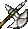
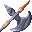
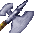
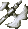
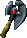
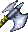
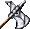
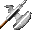
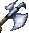
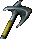

# Battle Axes
| Item | Description |
| :-------: | :-------  |
| *AX1H01*  | **Battle Axe**  The most common version of the battle axe is a stout pole about four feet in length with a single-edged, trumpet-shaped blade mounted on one end.  Battle axes are also called broad axes.   STATISTICS:  Damage:  1D8 Damage type:  slashing Weight: 7 Speed Factor: 7 Proficiency Type: Axe Type:  1-handed Requires: 10 Strength Not Usable By:  Druid  Cleric  Mage   Thief|
| *AX1H02*  | **Battle Axe +1**  The most common version of the battle axe is a stout pole about four feet in length with a single-edged, trumpet-shaped blade mounted on one end.  Battle axes are also called broad axes.  This is a magical axe.  STATISTICS:  THAC0: +1 bonus Damage:  1D8 + 1 Damage type:  slashing Weight: 7 Speed Factor: 6 Proficiency Type: Axe Type:  1-handed Requires: 10 Strength Not Usable By:  Druid  Cleric  Mage   Thief|
| *AX1H03*  | **Battle Axe +2**  The most common version of the battle axe is a stout pole about four feet in length with a single-edged, trumpet-shaped blade mounted on one end.  Battle axes are also called broad axes.  Magical battle axes are normally crafted by dwarves to help defend their warriors against their harsher neighbors.  This magical axe has seen many battles but its enchantments and craftsmanship make it a very capable weapon still.  STATISTICS:  THAC0: +2 bonus Damage:  1D8 +2 Damage type:  slashing Weight: 5 Speed Factor: 5 Proficiency Type: Axe Type:  1-handed Requires: 10 Strength Not Usable By:  Druid  Cleric  Mage   Thief|
| *AX1H07*  | **Bala's Axe**  Bala's Axe - Wizard Slayer: Bala was a foul-tempered prince of a gully dwarf clan, which was enslaved by a cruel elven mage in Thesk. Though Bala managed to escape the more cowardly traits of his race he was even more filthy and obnoxious than the average gully dwarf. Sickened of his enslavement, Bala crept into the mage's lair and cracked the elf's skull open. Although rumor has it that it was the dwarf's stench that overcame the mage, it was, in fact, his enchanted axe that dispelled the elf's magical defenses. It is obvious from the poor workmanship that Bala himself crafted the axe. The mystery lies in where its power originates. After a lengthy career of mage-slaying, Bala died, never having revealed his secret to those who were willing to risk a lice infestation by approaching him. Some say that the axe was powered by Bala's intense hatred of wizards. The axe gives the owner the ability to dispel magic once a day.  STATISTICS:  Damage:  1D8 Damage type:  slashing  Special:  Miscast Magic affects victim on each successful hit Miscast Magic:  Any spellcasting creature that is affected by this spell has its casting ability severely disabled.  When the creature attempts to cast a spell it has an 80% chance of failure.  Creatures can save vs spells to avoid the affect, but do so at -2.   Weight: 6 Speed Factor: 7 Proficiency Type: Axe Type:  1-handed Requires: 10 Strength Not Usable By:  Druid  Cleric  Mage   Thief|
| *AX1H11*  | **Battle Axe +2**  The most common version of the battle axe is a stout pole about four feet in length with a single-edged, trumpet-shaped blade mounted on one end.  Battle axes are also called broad axes.  Magical battle axes are normally crafted by dwarves to help defend their warriors against their harsher neighbors.  This magical axe has seen many battles but its enchantments and craftsmanship make it a very capable weapon still.  STATISTICS:  THAC0: +2 bonus Damage:  1D8 +2 Damage type:  slashing Weight: 5 Speed Factor: 5 Proficiency Type: Axe Type:  1-handed Requires: 10 Strength Not Usable By:  Druid  Cleric  Mage   Thief|
| *AX1H12*  | **Battle Axe +3, Stonefire**  Stonefire, Battle Axe +3 The Stonefires were an old lineage of dwarves, and the eldest male of the line carried this axe, an heirloom of utmost importance.  Unfortunately they were decimated in 1150DR, falling in a mere two years to a mysterious plague.  Ulgan, keeper of the axe, fled in the hopes of escaping the inevitable, but he died several weeks later.  His body was found in the Cloakwood Forest, but the axe was missing.  STATISTICS:  THAC0: +3 bonus  Damage: 1D8 +3, +2 points fire damage to target Damage type (melee):  slashing Weight: 7 Speed Factor: 4 Proficiency Type: Axe Type:  1-handed Requires: 10 Strength Not Usable By:  Druid  Cleric  Mage   Thief|
| *AX1H13*  | **Battle Axe +3, Frostreaver**  Frostreaver, Battle Axe +3 This was the axe of Illgarth, a Frost Giant that terrorized northern communities long ago.  It is not known where he acquired the weapon, but he took a perverse pleasure in unleashing it upon small folk, particularly halflings.  Ice and acid maimed those not killed, and the giant would laugh coldly if he recognized his handiwork from a previous visit.  Ultimately a group did manage to kill him, and at the request of his victims Frostreaver was buried with him.     STATISTICS:  Combat Ability:   + 1 point cold damage to target  + 1 point acid damage to target THAC0: +3 bonus  Damage: 1D8 +3 Damage type:  slashing Weight: 7 Speed Factor: 4 Proficiency Type: Axe Type:  1-handed Requires: 10 Strength Not Usable By:  Druid  Cleric  Mage   Thief|
| *AX1H14*  | **Axe of the Unyielding +3**  This axe was last seen in the gnarled fists of Glimred Heavyhand, an aging dwarven hero who disappeared in the deepest caverns beneath the Marching Mountains.  STATISTICS:  Equipped Abilities:    Improves AC by 1   User regenerates 1 hp/round THAC0: +3 bonus  Damage: 1D8 +3 Damage type:  slashing Weight: 7 Speed Factor: 4 Proficiency Type: Axe Type:  1-handed Requires: 10 Strength Not Usable By:  Druid  Cleric  Mage  Thief|
| *AX1H15*  | **Axe of the Unyielding +5**  Enhanced by the magic of the Balor's Claw, the Axe of the Unyielding is now the most fearsome of weapons - a vorpal-edged axe capable of severing an opponents head with a single blow.   STATISTICS:  Equipped Abilities:    Improves AC by 1   User regenerates 3 hp/round   Increase user's constitution by +1  Combat Abilities:   10% chance of instantly killing an opponent by decapitation with each successful attack  THAC0: +5 bonus  Damage: 1D8 +5 Damage type:  slashing Weight: 5 Speed Factor: 2 Proficiency Type: Axe Type:  1-handed Requires: 10 Strength Not Usable By:  Druid  Cleric  Mage   Thief|
| *AX1H17*  | **Battle Axe +3**  The most common version of the battle axe is a stout pole about four feet in length with a single-edged, trumpet-shaped blade mounted on one end.  Battle axes are also called broad axes.  Magical battle axes are normally crafted by dwarves to help defend their warriors against their harsher neighbors.  This magical axe has seen many battles but its enchantments and craftsmanship make it a very capable weapon still.  STATISTICS:  THAC0: +3 bonus Damage:  1D8 +3 Damage type:  slashing Weight: 4 Speed Factor: 4 Proficiency Type: Axe Type:  1-handed Requires: 10 Strength Not Usable By:  Druid  Cleric  Mage   Thief|
| *KORAX01*  | **Battle Axe +1**  The most common version of the battle axe is a stout pole about four feet in length with a single-edged, trumpet-shaped blade mounted on one end.  Battle axes are also called broad axes.  This is a magical axe.  STATISTICS:  THAC0: +1 bonus Damage:  1D8 + 1 Damage type:  slashing Weight: 7 Speed Factor: 6 Proficiency Type: Axe Type:  1-handed Requires: 10 Strength Not Usable By:  Druid  Cleric  Mage   Thief|

# Hand Axes
| Item | Description |
| :-------: | :-------  |
| *AX1H04*  | **Throwing Axe**  The hand axe or throwing axe is also known as a hatchet.  The axe blade has a sharp steel tip, counterbalanced by a pointed fluke.  The short handle has a point on the bottom and the head may have a spike on the top.  STATISTICS:  Damage:  1D6 +1 Damage type:  missile (piercing) Weight: 5 Speed Factor: 4 Proficiency Type:  Axe Type:  1-handed Requires: 4 Strength Not Usable By:  Druid  Cleric  Mage   Thief|
| *AX1H05*  | **Throwing Axe +2**  This throwing axe has not only been finely balanced for use as a missile weapon but has also been the subject of significant magical enhancement. As a result, it is both more damaging and more accurate than any non-magical weapon of a similar style.   STATISTICS:  THACO:  +2 bonus Damage:  1D6 + 3 Damage type(melee):  slashing Damage type(thrown):  missile (piercing) Special:  Returns to users hand once thrown Weight: 3 Speed Factor: 2 Proficiency Type: Axe Type:  1-handed Requires: 4 Strength Not Usable By:  Druid  Cleric  Mage   Thief|
| *AX1H06*  | **Throwing Axe +2**  This throwing axe has not only been finely balanced for use as a missile weapon but has also been the subject of significant magical enhancement. As a result, it is both more damaging and more accurate than any non-magical weapon of a similar style.   STATISTICS:  THACO:  +2 bonus Damage:  1D6 + 3 Damage type(melee):  slashing Damage type(thrown):  missile (piercing) Special:  Returns to users hand once thrown Weight: 3 Speed Factor: 2 Proficiency Type: Axe Type:  1-handed Requires: 4 Strength Not Usable By:  Druid  Cleric  Mage   Thief|
| *AX1H08*  | **Hangard's Axe +2**  Hangard's Axe of Hurling If this weapon had a lofty beginning, it has been overshadowed by the exploits of its most famous owner, Hangard the dwarf.  Hangard made a habit of trying to knock melons and apples off the heads of comrades.  He missed more often than not, due in part to an unfortunate fondness for ale.  STATISTICS:  Combat Abilities: Axe returns to the wielder's hand instantly after an attack is made THAC0:  +2 bonus Damage:  1D6 + 2 Damage type (melee):  slashing Damage type (thrown):  missile (piercing) Special:  Returns to user's hand once thrown Weight: 3 Speed Factor: 2 Proficiency Type: Axe Type:  1-handed Requires: 4 Strength Not Usable By:  Druid  Cleric  Mage   Thief|
| *AX1H09*  | **Rifthome Axe +3**  Rifthome Axe This Axe of Hurling is one of the most heavily enchanted weapons of its type.  Its markings are vaguely dwarven, but no dwarf yet encountered on Faerun has claimed a kinship with the maker.  This causes some to speculate that it may not be the product of a terrestrial dwarven hand, rather some extra-planar variant.  Dwarves laugh this off, of course, claiming the maker likely has no time for nosey scholars.   STATISTICS:  Combat Abilities: Axe returns to the wielder's hand instantly after an attack is made THAC0:  +3 bonus Damage:  1D6 + 3 Damage type (melee):  slashing Damage type (thrown):  missile (piercing) Special:  Returns to user's hand once thrown Weight: 2 Speed Factor: 1 Proficiency Type: Axe Type:  1-handed Requires: 4 Strength Not Usable By:  Druid  Cleric  Mage   Thief|
| *AX1H10*  | **Azuredge**  Azuredge Axe +3 Gulen Rockfire, Slayer of Undead, crafted this powerful throwing axe expressly for reinforcing his claim to his namesake.  Blessed by a cross-section of gods, this weapon does phenomenal damage against creatures unwisely rebelling against their deceased status, and can potentially destroy them in a single blow.  Obviously Gulen no longer carries Azuredge, and it is rumored that he died fighting a powerful vampire years ago, only to rise as one himself.  This may have softened his stance regarding the undead, at the very least prompting a change of name.  STATISTICS:  Combat Ability: 1-6 +4 extra damage to undead, plus they must make a saving throw vs. death (-4 penalty) or be utterly destroyed Damage: 1D6 Damage type (melee):  slashing Damage type (thrown):  missile (piercing) Special:  Returns to user's hand once thrown Weight: 2 Speed Factor: 1 Proficiency Type: Axe Type:  1-handed Requires: 4 Strength Not Usable By:  Any Neutral or Evil Character  Druid  Cleric  Mage   Thief|
| *AX1H16*  | **K'logarath +4**  The origins of this throwing axe are known only to denizens of the Underdark.  What is known is that clans of duergar have gone to war simply to possess this artifact.  STATISTICS:  Combat Abilities:     Axe returns to the wielder's hand instantly after an attack is made    Target must save vs death or be knocked down and take 2D6 extra damage with each successful hit  THAC0:  +4 bonus Damage:  1D6 + 4 Damage type (melee):  slashing Damage type (thrown):  missile (piercing) Special:  Returns to user's hand once thrown Weight: 1 Speed Factor: 0 Proficiency Type: Axe Type:  1-handed Requires: 4 Strength Not Usable By:  Druid  Cleric  Mage   Thief|
