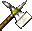
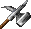
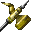
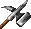
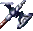
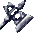
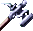
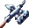
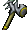
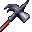

# War Hammers
| Item | Description |
| :-------: | :-------  |
| *HAMM01*  | **War Hammer**  Mounted knights cannot effectively use long pole weapons while on horseback, and as a result, many weapons have been fitted with shorter shafts so they may be wielded with just one hand.  Maces and flails are two previous examples of this - the war hammer is another.  The horseman's war hammer is a descendant of the Lucerne hammer.  It is made entirely of steel, with rondels protecting and strengthening the grip.  Rondels are small disks of metal, often shaped into decorative designs.  The shaft is about 18 inches long.  STATISTICS:  Damage:  1D4 + 1 Damage type:  crushing Weight: 6 Speed Factor: 4 Proficiency Type: War Hammer Type:  1-handed Requires: 9 Strength Not Usable By:  Druid  Mage   Thief|
| *HAMM02*  | **War Hammer +1**  Like others of its type, this war hammer is made entirely of steel, with a bone-crushing hammer mounted upon an 18" shaft.  It has also been bestowed with a small number of magical properties, however, thus making it more effective in combat.  STATISTICS:  THAC0:  +1 bonus Damage:  1D4 + 2 Damage type:  crushing Weight: 6 Speed Factor: 3 Proficiency Type: War Hammer Type:  1-handed Requires: 9 Strength Not Usable By:  Druid  Mage  Thief|
| *HAMM03*  | **War Hammer +2**  War Hammer +2:  'Ashideena' Lady Ashideena was a remarkable strategist who honed her skills against the orc armies in the Year of the Black Horde.  She met Dergat Wiltoon -the warrior that wielded this weapon- when he foiled an ambush led by the great orc Varstok, and soon after made him her Field Captain.  After serving at each other's side for the entirety of the war they fell in love and eventually married.  Historians report that Dergat named his war hammer after his bride to remind himself of the love he fought to protect.  What Lady Ashideena thought of this is unknown.  STATISTICS:  THAC0:  +2 bonus Damage:  1D4 +3, +1 electrical Damage type:  crushing Weight: 5 Speed Factor: 2 Proficiency Type: War Hammer Type:  1-handed Requires: 9 Strength Not Usable By:  Druid  Mage   Thief|
| *HAMM04*  | **War Hammer +1,+4 vs. Giantkin**  War Hammer +1, +4 vs. Giant Humanoids: The Knee-capper, or "The Capper", as it is affectionately known in dwarven circles, is rumored to have been forged by Clangeddin himself. He gave it to a small clan of homeless dwarves that they might carve a place for themselves amongst the giants and ogres in their area. The hammer has been passed from hero to hero, occasionally finding its way into non-dwarven hands.  STATISTICS:  THAC0:  +1 bonus, +4 vs. giants Damage:  1D4 + 2, +5 vs. giants Damage type:  crushing Weight: 8 Speed Factor: 2 Proficiency Type: War Hammer Type:  1-handed Requires: 10 Strength Not Usable By:  Druid  Mage   Thief|
| *HAMM05*  | **War Hammer +2**  War Hammer +2, +1 electrical: 'Borok's Fist' Borok Thundercracker was a dwarven hero that led several campaigns against giants and other "tall vermin" that had plagued his people in a number of their communities.  This hammer was his blessed weapon, which his elven allies called his "little iron fist", though not to his face.  STATISTICS:  Combat Abilities: +1 electricity damage THAC0: +2 bonus Damage:  1D4 + 3 Damage type:  crushing Weight: 5 Speed Factor: 2 Proficiency Type: War Hammer Type:  1-handed Requires: 9 Strength Not Usable By:  Druid  Mage   Thief |
| *HAMM06*  | **Dwarven Thrower +3**  Dwarven Thrower, War Hammer +3, This hammer -- not to be confused with the elven-made Dwarf Thrower -- is only usable by dwarves.  In the capable hands of a dwarven warrior the hammer may be thrown at an opponent.  The magic in the hammer draws it back to the hand of its wielder.  If it hits an opponent it does double the normal damage that a hammer would normally do.  Against giants and ogres the hammer does an additional +8 damage, due to the special hatred that dwarves hold against these races.  STATISTICS:  Combat Abilities: Returns to thrower THAC0: +3 bonus Damage:  2D4 + 3, + 8 additional damage to giants and ogres Damage type:  crushing Weight: 4 Speed Factor: 1 Proficiency Type: War Hammer Type:  1-handed Requires: 9 Strength Not Usable By: Non-dwarves  Druid  Mage   Thief|
| *HAMM07*  | **Hammer of Thunderbolts +3**  Hammer of Thunderbolts  A dwarven smith, Silverblade, forged this hammer and two other items; a girdle of giant strength and a pair of gauntlets of ogre power.  His intention was to gift them to his son, who was then a high officer in the dwarven armies, fighting the giant and ogre tribes of the area.  Unfortunately Silverblade's son died just after the completion of the three items and before they could be gifted to him.  In grief Silverblade himself donned the girdle and the gauntlets.  Taking up the Hammer of Thunderbolts he went to battle against the giant folk.  He died valiantly. Alone, the Hammer of Thunderbolts is a powerful magical weapon but when merged with the gauntlets of ogre power and the girdle of giant strength the hammer is transformed.  This transformation requires magical assistance.  The Hammer of Thunderbolts is then capable of doing an additional +8 damage as well as instantly killing any giant or ogre that it strikes.  STATISTICS:  THAC0: +3 bonus Damage:  2D4 + 3 Damage type:  crushing Weight: 4 Speed Factor: 1 Proficiency Type: Warhammer Type:  1-handed Requires: 18 Strength Not Usable By:  Druid  Mage   Thief|
| *HAMM08*  | **War Hammer +2**  Mounted knights cannot effectively use pole arms while on horseback, and as a result, many weapons have been altered so they may be used one-handed.  The horseman's war hammer is made entirely of steel, and has a shaft about 18 inches long.  Powerful magical energy flows through this weapon, though its origins are nondescript.  STATISTICS:  THAC0:  +2 bonus Damage:  1D4 +3 Damage type:  crushing Weight: 5 Speed Factor: 2 Proficiency Type: War Hammer Type:  1-handed Requires: 9 Strength Not Usable By:  Druid  Mage   Thief|
| *HAMM09*  | **Crom Faeyr**  Crom Faeyr  This is the true name that the dwarven weaponsmith, Silverblade, gave to the weapon he intended to create for his son.  Alas, his son died before the weapon was ever completed, but here it stands complete... forged from the combined magic of the original hammer with the Gauntlets of Ogre Power and a Girdle of Frost Giant Strength.  Crom Faeyr gifts its users with all the powers of the original Hammer of Thunderbolts, in addition to enormous strength and the ability to kill golems, ettins and trolls in one blow.  STATISTICS:  Special Abilities:   grants 25 Strength   kills Stone Golems, Clay Golems, Ettins and Trolls THAC0: +5 bonus Damage:  2D4 + 3 Damage type:  crushing Weight: 4 Speed Factor: 1 Proficiency Type: War Hammer Type:  1-handed Not Usable By:  Druid  Mage   Thief|
| *HAMM10*  | **Runehammer +4**  This darksteel hammer has a rune of power inscribed upon its head, and has many of the powers of a Mace of Disruption.  STATISTICS:  Equipped Abilities: Negative Plane Protection  Combat Abilities:4-16 +8 damage to Undead, plus they must make a saving throw vs. death (-4 penalty) or be utterly destroyed  THAC0: +4 bonus Damage:  2D4 + 4 Damage type:  crushing Weight: 3 Speed Factor: 0 Proficiency Type: Warhammer Type:  1-handed Requires: 16 Strength Not Usable By:  Druid  Mage   Thief|
| *HAMM11*  | **Runehammer +5**  The Rune of Clangeddin is now inscribed on the head of this hammer, granting even greater powers to any who wield the weapon.  STATISTICS:  Equipped Abilities: Negative Plane Protection    Immunity to Fear    Fire Giant Strength once/day    Mass Cure once/day    Combat Abilities:4-16 +10 damage to Undead, plus they must make a saving throw vs. death (-4 penalty) or be utterly destroyed  THAC0: +5 bonus Damage:  2D4 + 5 Damage type:  crushing Weight: 2 Speed Factor: 0 Proficiency Type: Warhammer Type:  1-handed Requires: 16 Strength Not Usable By:  Druid  Mage  Thief|
| *HAMM12*  | **War Hammer +3**  Mounted knights cannot effectively use pole arms while on horseback, and as a result, many weapons have been altered so they may be used one-handed.  The horseman's war hammer is made entirely of steel, and has a shaft about 18 inches long.  Powerful magical energy flows through this weapon, though its origins are nondescript.  STATISTICS:  THAC0:  +3 bonus Damage:  1D4 +4 Damage type:  crushing Weight: 4 Speed Factor: 1 Proficiency Type: War Hammer Type:  1-handed Requires: 9 Strength Not Usable By:  Druid  Mage   Thief|
